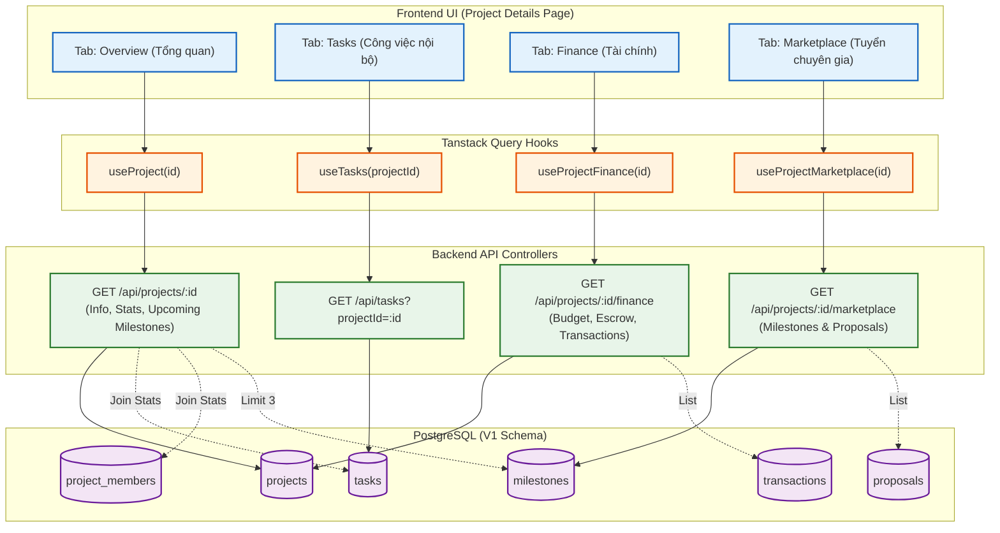

# Sơ đồ Luồng (Flowchart): Client View Project Details (Từ góc nhìn Backend)

Trang chi tiết dự án thường được chia làm nhiều Tab. Ở cấu trúc V1 Schema, thay vì gọi một cục API khổng lồ, Backend đã tách dữ liệu thành các endpoint chuyên biệt để tối ưu hiệu suất. Sơ đồ dưới đây mô tả cách UI (thông qua TanStack Query) lấy dữ liệu từ các API tương ứng.

> [!NOTE] 
> **Lợi ích của việc tách API (V1 Schema):**
> - **Tab Overview** load rất nhanh vì chỉ query cơ bản bảng `projects` và đếm (`count`) số lượng Task/Member.
> - **Tab Finance** được cô lập dữ liệu giao dịch (`transactions`), giúp tính toán số dư Escrow và Spent dễ dàng hơn.
> - **Tab Marketplace** chỉ load Proposals (thay cho Bids cũ) khi Client cần duyệt ứng viên cho Milestones. Dữ liệu này không làm nặng các Tab khác.
