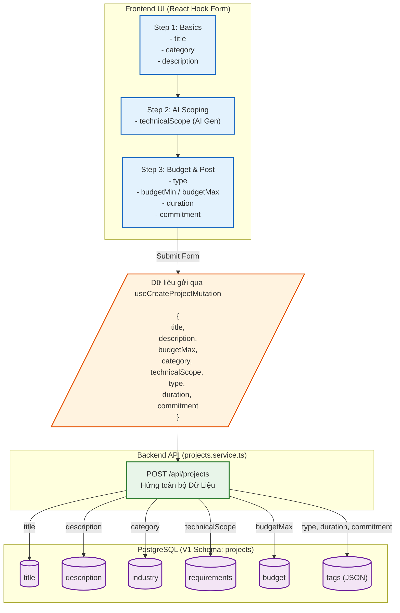

# Sơ đồ Luồng (Flowchart): Client Create Project (Từ góc nhìn Backend)

Sơ đồ này mô tả chi tiết quá trình từ lúc người dùng (Client) nhập dữ liệu qua 3 bước của Wizard trên Frontend, cho đến khi dữ liệu được đóng gói gửi đi và cách Backend ánh xạ (map) vào Database.

> [!NOTE] 
> Nhờ việc refactor ở Backend, toàn bộ những thông tin giá trị mà AI sinh ra (như `technicalScope`) hoặc phân loại từ UI (như `category`, `duration`) không còn bị vứt bỏ như trước đây. Chúng đã được Backend gom vào đúng các cột được thiết kế trong Schema V1 (`requirements`, `industry`, `tags`).
