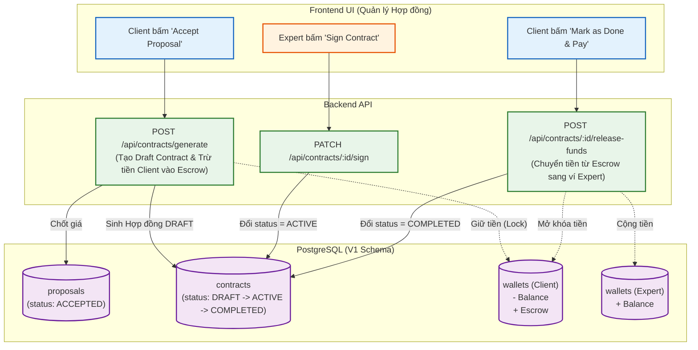

# Sơ đồ Luồng (Flowchart): Contracts & Escrow (Từ góc nhìn Backend)

Sơ đồ mô tả quy trình Ký kết Hợp đồng (Contract) và Giữ tiền an toàn (Escrow). Đây là trái tim của hệ thống tài chính nhằm đảm bảo quyền lợi cho cả Client (không mất tiền oan) và Expert (chắc chắn được trả lương).

> [!CAUTION]
> **Rủi ro UI thường gặp:**
> Ở V1 Schema, việc Client chọn ứng viên (Accept) KHÔNG ĐỒNG NGHĨA với việc Expert có thể bắt tay vào làm ngay. UI Agent bắt buộc phải xây dựng thêm màn hình **"Chờ Expert ký Hợp đồng"**. Chỉ khi nào Contract chuyển sang `ACTIVE`, chức năng submit kết quả của Expert mới được mở khóa.
> Ngoài ra, tiền sẽ bị giam (Escrow) ngay lập tức lúc Client Accept, nên UI cần gọi lại hàm lấy `user.wallet` để cập nhật số dư hiển thị!
