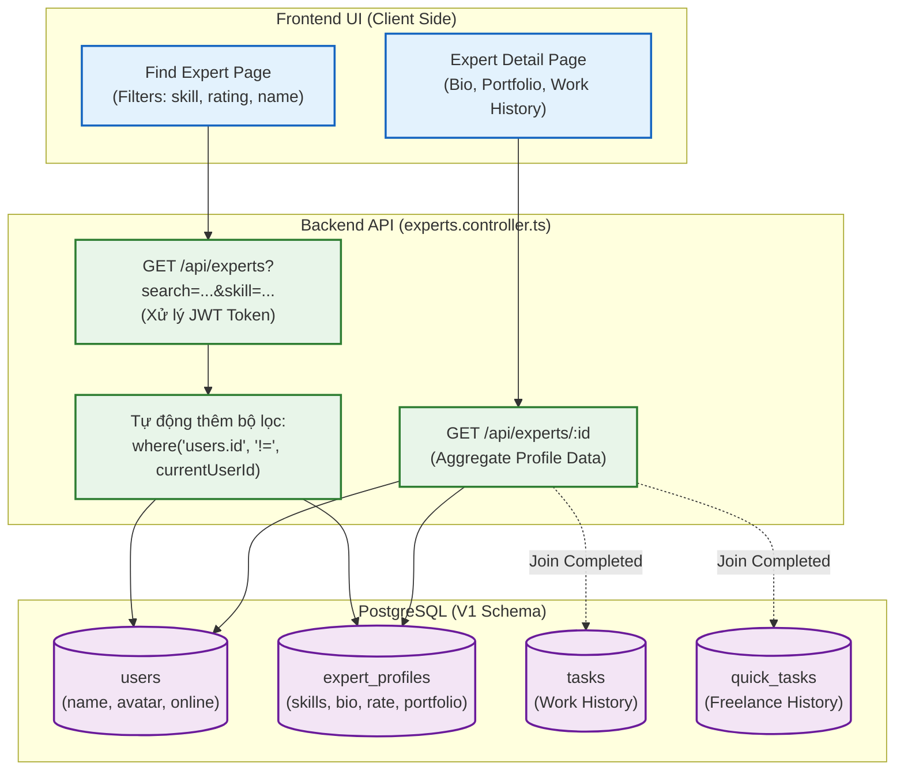

# Sơ đồ Luồng (Flowchart): Expert Discovery & Profiles (Từ góc nhìn Backend)

Sơ đồ này mô tả cách Client tìm kiếm chuyên gia (Find Expert) và xem chi tiết hồ sơ chuyên gia (Expert Profile). Điểm nhấn là việc Backend tự động lọc bỏ tài khoản của chính Client khỏi kết quả tìm kiếm và tổng hợp (aggregate) dữ liệu CV từ nhiều bảng (expert_profiles, users, tasks).

> [!TIP]
> Frontend chỉ việc gọi 1 API duy nhất `/api/experts/:id` cho trang Profile. Backend sẽ tự động gộp lịch sử làm việc từ cả 2 bảng `tasks` (Project nội bộ) và `quick_tasks` (Freelance Marketplace) để trả về một `workHistory` hoàn chỉnh.
