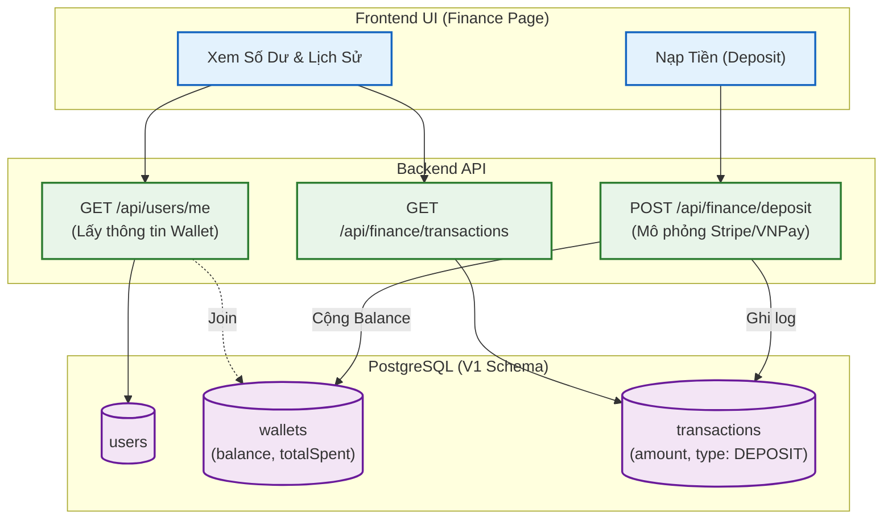

# Sơ đồ Luồng (Flowchart): Finance & Wallet (Từ góc nhìn Backend)

Sơ đồ mô tả quy trình nạp tiền, quản lý ví (Wallet) và lịch sử giao dịch (Transactions). Số dư của User không còn nằm trên bảng User nữa mà được tách riêng.

> [!IMPORTANT]
> UI Agent cần chú ý: Khi render số dư trên Navbar, dữ liệu sẽ nằm ở `user.wallet.balance` (Data Transfer Object: `MeProfileDto`), không còn là `user.balance` như V0 nữa. Hàm Deposit ở Backend hiện đã tự động tính toán `balanceAfter` và lưu vào bảng transaction.
