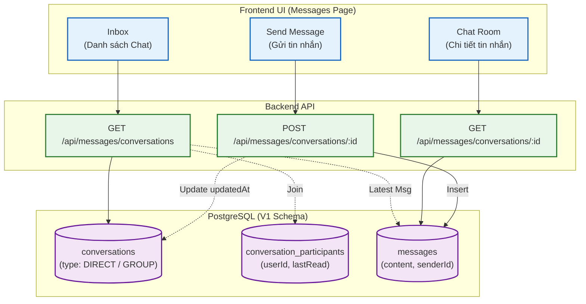

# Sơ đồ Luồng (Flowchart): Messaging & Chat (Từ góc nhìn Backend)

Sơ đồ mô tả luồng giao tiếp thời gian thực (hoặc near-realtime) giữa Client và Expert/Team. Dữ liệu tin nhắn được quản lý theo mô hình Hội thoại (Conversations) và Người tham gia (Participants).

> [!NOTE]
> Mọi cuộc trò chuyện đều phải thuộc về một `conversationId`. Backend sử dụng bảng trung gian `conversation_participants` để biết user nào được quyền xem tin nhắn trong phòng chat nào. UI Agent chú ý gọi API lấy danh sách Conversations trước khi fetch tin nhắn chi tiết.
