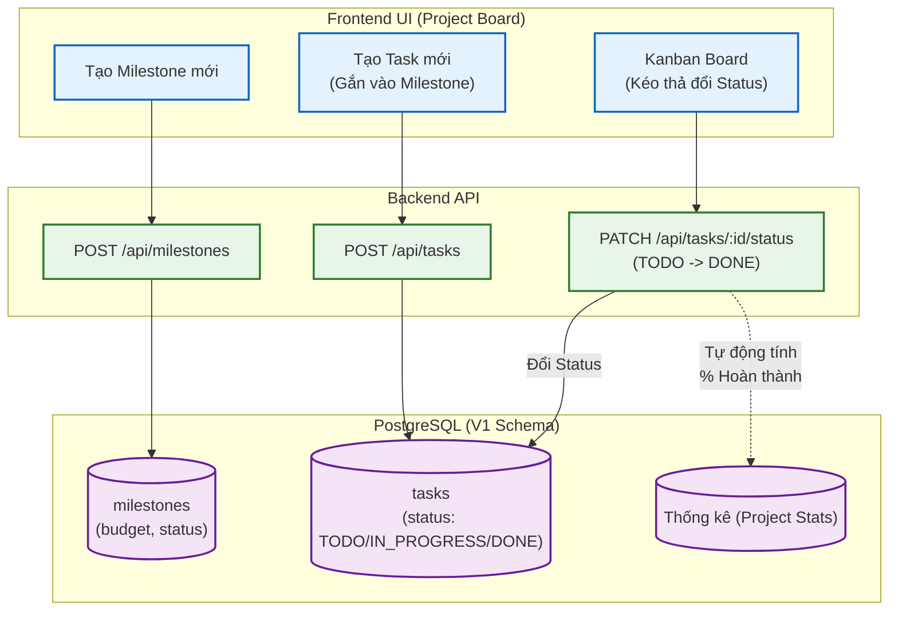

# Sơ đồ Luồng (Flowchart): Project Execution & Tasks (Từ góc nhìn Backend)

Sơ đồ mô tả quy trình thực thi Dự án nội bộ, bao gồm việc chia nhỏ thành các Cột mốc (Milestones) và giao Công việc (Tasks) cho các thành viên.

> [!TIP]
> - **Tasks** ở đây là công việc nội bộ của một Project.
> - Bất kỳ thao tác đổi trạng thái Task nào (`PATCH /api/tasks/:id/status`) cũng sẽ gián tiếp làm thay đổi tiến độ (% Completion) của Project khi load tab Overview.
> - Bảng `tasks` không còn trường `description` và `progress` nữa, UI Agent lưu ý đừng gởi lên API 2 field này.
