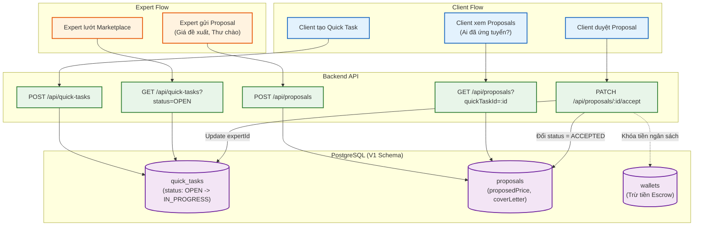

# Sơ đồ Luồng (Flowchart): Quick Tasks & Proposals (Từ góc nhìn Backend)

Sơ đồ mô tả quy trình của Freelance Marketplace: Client đăng một công việc làm nhanh (Quick Task) -> Expert tìm thấy và ứng tuyển (Proposal) -> Client duyệt và chọn.

> [!WARNING]
> Lưu ý với UI Agent: Ở schema V1, bảng "Bids" đã bị đổi tên thành `proposals`. Payload khi gửi lên `POST /api/proposals` phải dùng `proposedPrice` (thay vì amount) và `coverLetter` (thay vì message).
