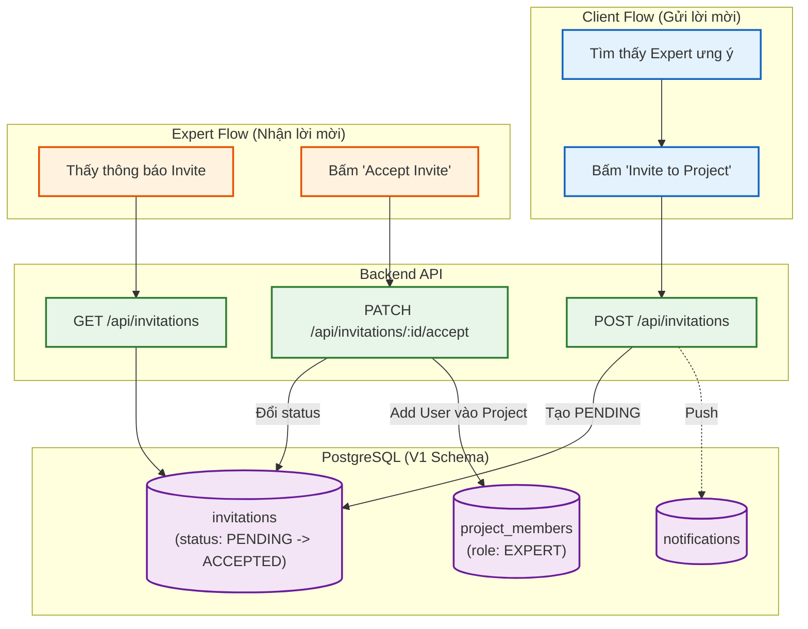

# Sơ đồ Luồng (Flowchart): Teams & Invitations (Từ góc nhìn Backend)

Sơ đồ mô tả quy trình mời người khác (Expert hoặc Internal Team) tham gia vào Project hoặc Quick Task.

> [!WARNING]
> Validation cực kỳ quan trọng ở Backend: Bạn không thể tự mời (Invite) chính mình vào một dự án! Điều này giải thích tại sao luồng Find Expert lại phải filter tài khoản của chính Client ra ngoài.
